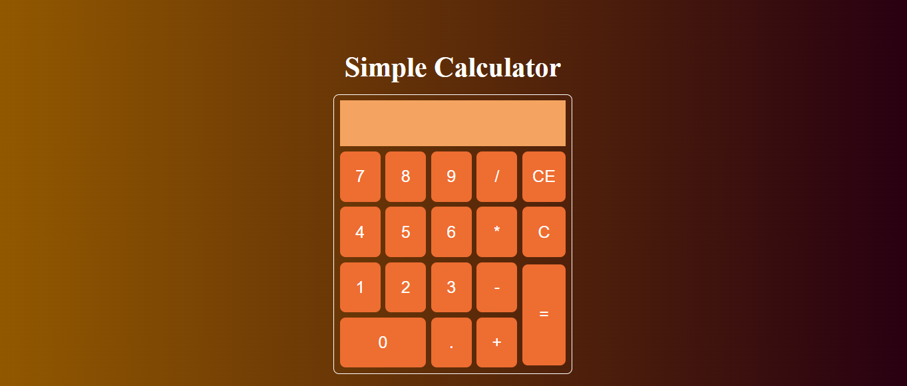

# JavaScript Projects

Welcome to the JavaScript Projects repository! This repository contains a collection of basic JavaScript projects to help you learn and practice JavaScript concepts.

## Projects

1. **Calculator**

    Description: A basic calculator application that performs arithmetic operations like addition, subtraction, multiplication, and division.

    

2. **Clock**

    Description: A simple digital clock application that displays the current time.

    

3. **To-Do List**

    Description: A simple to-do list application where users can add, remove, and mark tasks as completed.

    

## Usage

Each project folder contains the necessary files and instructions to run the project. Follow the instructions provided in each project's README file to set up and run the project locally.

## License

This project is licensed under the MIT License - see the [LICENSE](LICENSE) file for details.

## Acknowledgments

- These projects were created for educational purposes.
- Inspiration from various online tutorials and resources.

---
